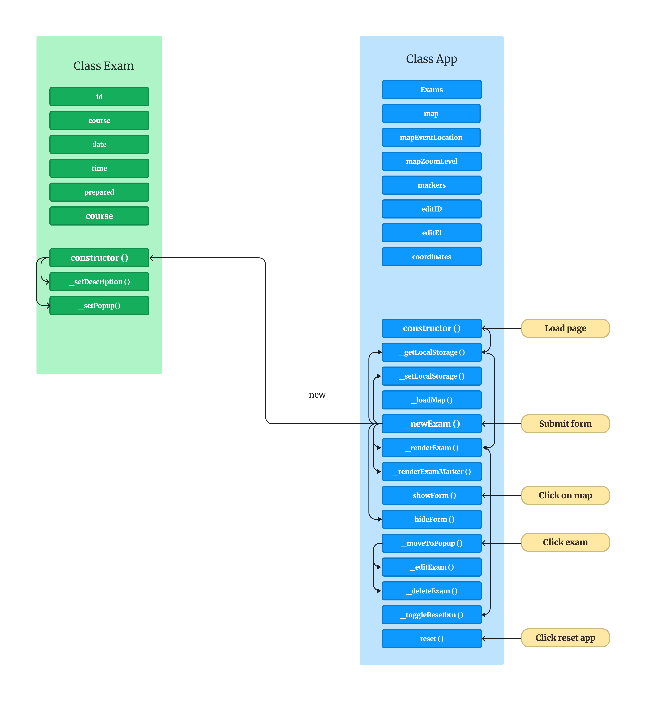

# Personal Project - Exam Tracker

This web app is used to keep track of my exams and pin their locations on OAU map. Please note that this project is designed as a desktop application. For the best experience, I recommend accessing it on a desktop or laptop device.

## Table of contents

- [Personal Project - Exam Tracker](#personal-project---exam-tracker)
  - [Table of contents](#table-of-contents)
  - [Overview](#overview)
    - [The challenge](#the-challenge)
    - [Screenshot](#screenshot)
    - [Links](#links)
  - [My process](#my-process)
    - [Built with](#built-with)
    - [What I learned](#what-i-learned)
    - [App Architecture](#app-architecture)
  - [Author](#author)

## Overview

### The challenge

Users should be able to:

  - Select any location on OAU campus map and log the exam in that location. In order to submit the esam, the user needs to fill out several details like course, prepared, date and time. Once the details are filled, click enter to submit.
  - Find the exam on the map by clicking on the exam details in the list. The list contains exam details like course, date, preparation, time, countdown, a motivational phrase based on prepartion, edit icon and delete icon. If the user reloads the page, all the data will be saved.
  - Edit an exam
  - Delete an exam
  - Delete all exams by clicking reset app

### Screenshot

### Links

- Solution URL: [solution URL](https://github.com/SoloLere/Exam-Tracker)
- Live Site URL: [live site URL](https://sololere.github.io/Exam-Tracker/)

## My process

### Built with

- Semantic HTML5 markup
- CSS
- vanilla JavaScript
- Leaflet API

### What I learned

- Local storage is blocking, so its not advisable to use it to store large data
- JSON.strigify - converts to obj to string
- JSON.parse - converts the string to obj, but I'll loose my prototype chain
- location.reload - reloads a page

### App Architecture

## Author

- Mail - [Oseni Solomon](jnrolalere@gmail.com)
- Frontend Mentor - [@myusername](https://www.frontendmentor.io/profile/@SoloLere)
- LinkedIn - [Oseni Solomon](https://www.linkedin.com/in/solomon-oseni-b00aa1154)
