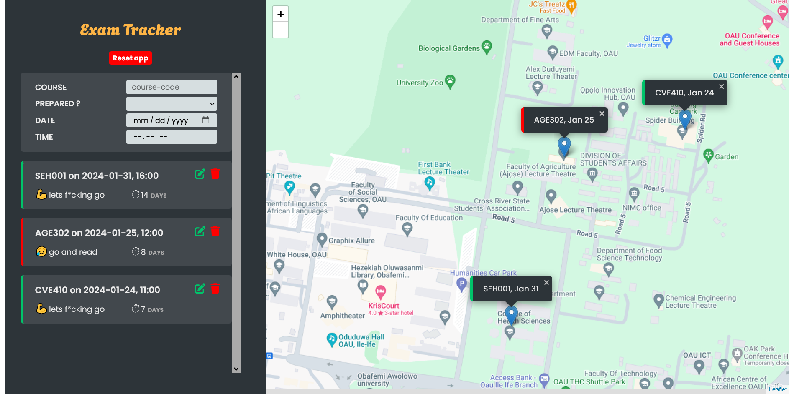

# Personal Project - Exam Tracker

This project is aimed at building my JS coding skills by building web app that can be used to keep track my upcoming exams and pin their locations on OAU map. 

## Table of contents

- [Personal Project - Exam Tracker](#personal-project---exam-tracker)
  - [Table of contents](#table-of-contents)
  - [Overview](#overview)
    - [The challenge](#the-challenge)
    - [Screenshot](#screenshot)
    - [Links](#links)
  - [My process](#my-process)
    - [Built with](#built-with)
    - [What I learned](#what-i-learned)
  - [Author](#author)

## Overview

### The challenge

Users should be able to:

- View the optimal layout for the component depending on their device's screen size
- See a hover state on desktop for the Sign Up call-to-action

### Screenshot

### Links

- Solution URL: [solution URL](https://github.com/SoloLere/price-grid.git)
- Live Site URL: [live site URL](https://sololere.github.io/price-grid/)

## My process

### Built with

- Semantic HTML5 markup
- CSS custom properties
- SASS
- Flexbox
- CSS Grid
- Mobile-first workflow

### What I learned

- The map element should be a direct child of the HTML body element.
- Local storage is blocking, so its not advisable to use it to store large data
- JSON.strigify - converts to obj to string
- JSON.parse - converts the string to obj, but I'll loose my prototype chain
- location.reload - reloads a page

## Author

- Mail - [Oseni Solomon](jnrolalere@gmail.com)
- Frontend Mentor - [@myusername](https://www.frontendmentor.io/profile/@SoloLere)
